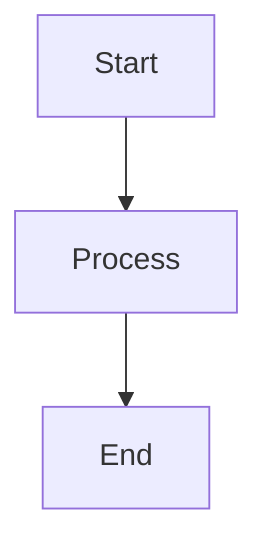

# EPDevio Wiki

An Angular-based wiki for high-level software documentation. Features Markdown content, Mermaid diagrams, Git repository links, and a flexible project/category structure.

## Features

- **Login system** – Sign in to add or edit content (default: `admin` / `admin`)
- **Markdown support** – Write docs in Markdown with full syntax
- **Mermaid diagrams** – Flowcharts, sequence diagrams, and more
- **Project organization** – Add projects with sub-categories and pages
- **Git integration** – Link projects to their repositories
- **File-based content** – MD files stored in `public/wiki/`

## Quick Start

```bash
npm install
npm start
```

Open [http://localhost:4200](http://localhost:4200).

## Project Structure

```
public/wiki/
├── config.json                 # Wiki structure (projects, categories, pages)
└── projects/
    └── sample/
        ├── overview/
        │   ├── readme.md
        │   └── architecture.md
        └── api/
            └── endpoints.md
```

### config.json

Defines projects, categories, and pages. Example:

```json
{
  "projects": [
    {
      "id": "sample",
      "title": "Sample Project",
      "gitRepo": "https://github.com/example/repo",
      "categories": [
        {
          "id": "overview",
          "title": "Overview",
          "pages": [
            {
              "id": "readme",
              "title": "Getting Started",
              "file": "wiki/projects/sample/overview/readme.md"
            }
          ]
        }
      ]
    }
  ]
}
```

### Adding Content

- **Logged out** – Browse and read only
- **Logged in** – Add projects, categories, and pages; edit page content

New items (and edits) are stored in `localStorage` and override file-based content for the current browser.

## Mermaid Examples

In any Markdown file:

````markdown

````

## Development

- `npm start` – Dev server at http://localhost:4200
- `npm run build` – Production build to `dist/`
