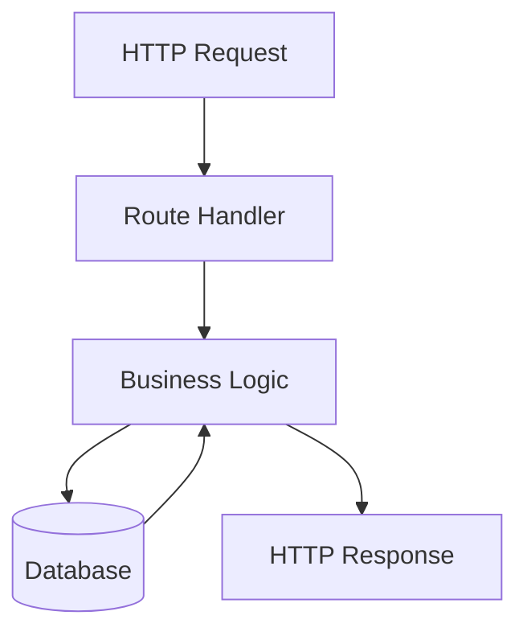
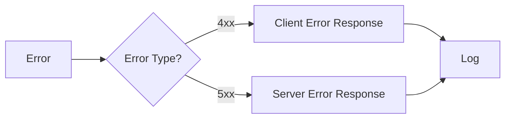

# API Endpoints

## Overview

| Method | Endpoint | Description |
|--------|----------|-------------|
| GET | `/api/projects` | List all projects |
| POST | `/api/projects` | Create a new project |
| GET | `/api/projects/:id` | Get project details |

## Data Flow

## Error Handling

