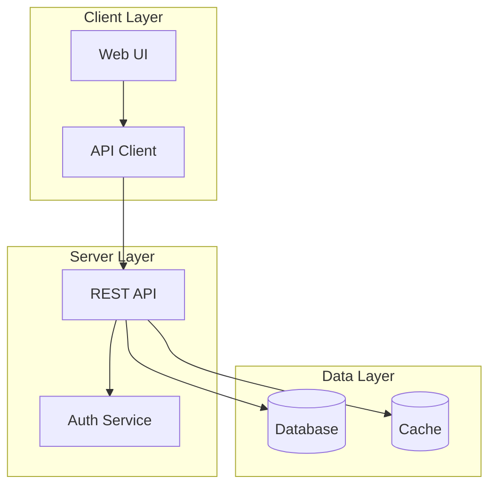
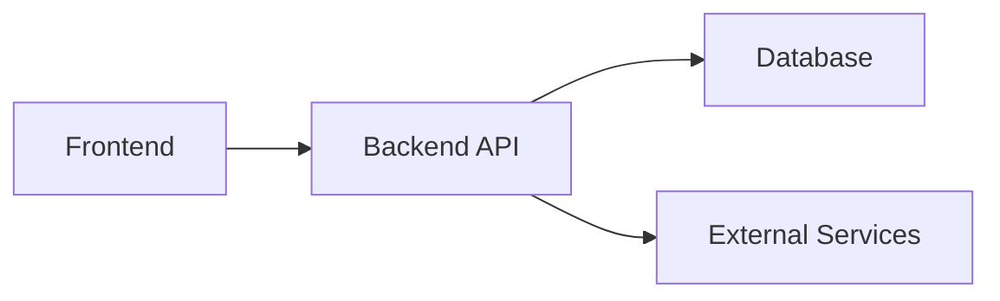
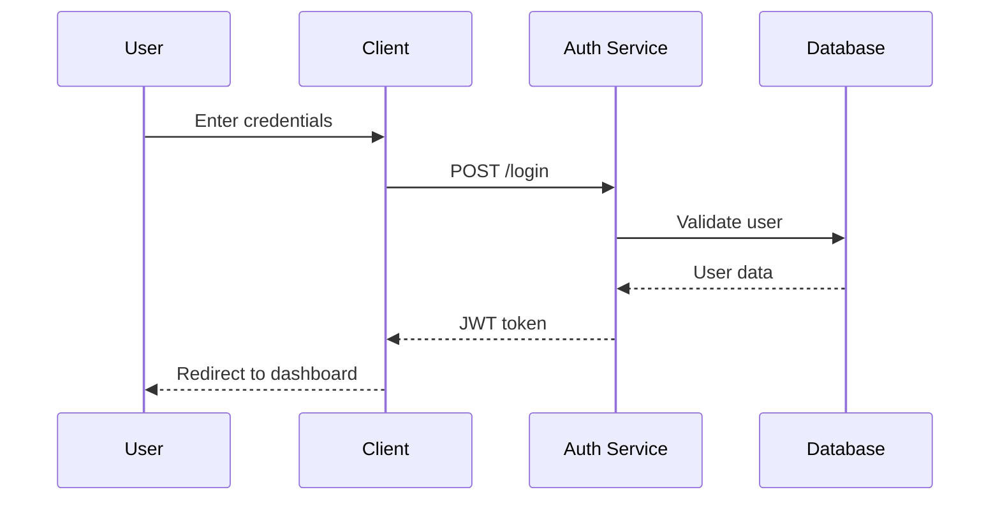

# Architecture

This document describes the high-level architecture of the sample project.

## System Overview

```mermaid
flowchart TB
    subgraph Client["Client Layer"]
        UI[Web UI]
        API_Client[API Client]
    end

    subgraph Server["Server Layer"]
        API[REST API]
        Auth[Auth Service]
    end

    subgraph Data["Data Layer"]
        DB[(Database)]
        Cache[(Cache)]
    end

    UI --> API_Client
    API_Client --> API
    API --> Auth
    API --> DB
    API --> Cache
```

## Component Diagram

```mermaid
flowchart LR
    A[Frontend] --> B[Backend API]
    B --> C[Database]
    B --> D[External Services]
```

## Sequence: User Login

```mermaid
sequenceDiagram
    participant U as User
    participant C as Client
    participant A as Auth Service
    participant D as Database

    U->>C: Enter credentials
    C->>A: POST /login
    A->>D: Validate user
    D-->>A: User data
    A-->>C: JWT token
    C-->>U: Redirect to dashboard
```
