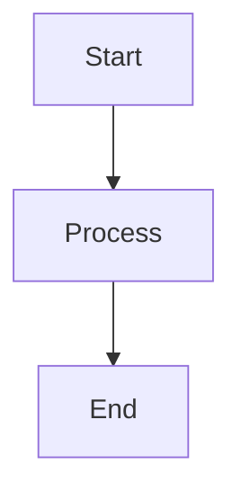
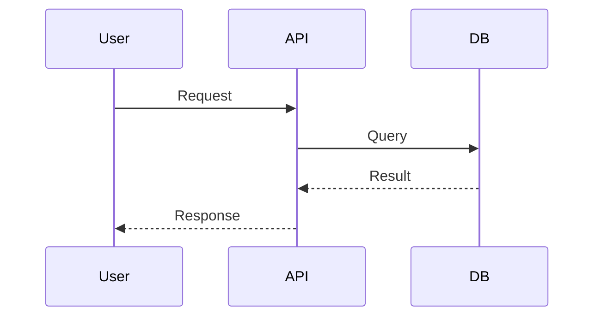

# EPDevio Wiki

A lightweight, Angular-based wiki for high-level software documentation. Document your projects with Markdown, Mermaid diagrams, and Git repository links—organized by projects and categories.


## Features

| Feature | Description |
|--------|-------------|
| **Login** | Sign in to add or edit content (default: `admin` / `admin`) |
| **Markdown** | Full Markdown support for documentation |
| **Mermaid** | Flowcharts, sequence diagrams, and more |
| **Projects & categories** | Organize docs in projects with sub-categories |
| **Git links** | Link projects to their repositories |
| **File-based content** | Store docs as `.md` files in your repo |

## Download Installers

| Platform | File | Description |
|----------|------|-------------|
| **Windows** | `EPDevio Wiki Setup 1.0.0.exe` | Installer with Start Menu & Desktop shortcut |
| **Windows** | `EPDevio Wiki 1.0.0.exe` | Portable – run without installing |
| **macOS** | `EPDevio Wiki-1.0.0.dmg` | Drag to Applications to install |
| **Linux** | `EPDevio Wiki-1.0.0.AppImage` | Single executable, runs on most distros |

Installers are built in the `release/` folder. See [Building installers](#building-installers) below.

## Quick Start (Web / Development)

```bash
# Clone the repository
git clone https://github.com/epdsn/EpdevioWiki.git
cd EpdevioWiki/EPDevioWiki

# Install dependencies
npm install

# Start development server
npm start
```

Open [http://localhost:4200](http://localhost:4200).

## Quick Start (Desktop App)

1. Download the installer for your platform from the [releases](https://github.com/epdsn/EpdevioWiki/releases) page (or build locally – see below).
2. **Windows:** Run `EPDevio Wiki Setup 1.0.0.exe` to install, or `EPDevio Wiki 1.0.0.exe` for portable use.
3. **macOS:** Open the `.dmg`, then drag EPDevio Wiki to your Applications folder.
4. **Linux:** Make the AppImage executable (`chmod +x EPDevio\ Wiki-1.0.0.AppImage`), then run it.

## Project Structure

```
EPDevioWiki/
├── public/
│   └── wiki/
│       ├── config.json          # Projects, categories, pages
│       └── projects/
│           └── sample/
│               ├── overview/
│               │   ├── readme.md
│               │   └── architecture.md
│               └── api/
│                   └── endpoints.md
├── src/
│   └── app/
└── ...
```

### Configuration (`public/wiki/config.json`)

Define your wiki structure:

```json
{
  "projects": [
    {
      "id": "my-project",
      "title": "My Project",
      "description": "Brief description",
      "gitRepo": "https://github.com/username/repo",
      "categories": [
        {
          "id": "overview",
          "title": "Overview",
          "pages": [
            {
              "id": "readme",
              "title": "Getting Started",
              "file": "wiki/projects/my-project/overview/readme.md"
            }
          ]
        }
      ]
    }
  ]
}
```

## Usage

| Mode | Capabilities |
|------|--------------|
| **Read-only** | Browse projects, categories, and pages |
| **Logged in** | Add projects, categories, and pages; edit content |

Edits and new items (when logged in) are stored in `localStorage` and override file-based content in your browser.

## Mermaid Diagrams

In any Markdown file:

````markdown

````

````markdown

````

## Scripts

| Command | Description |
|---------|-------------|
| `npm start` | Development server at http://localhost:4200 |
| `npm run build` | Production build to `dist/` |
| `npm run watch` | Build with watch mode |
| `npm run electron` | Run desktop app (requires `npm run build` first) |
| `npm run electron:dev` | Build and run desktop app |
| `npm run dist` | Build installers for current OS |
| `npm run dist:win` | Build Windows installer (`.exe`) |
| `npm run dist:mac` | Build macOS installer (`.dmg`) |
| `npm run dist:linux` | Build Linux AppImage |

## Building installers

From the `EPDevioWiki` folder:

```bash
cd EPDevioWiki

# Windows (on Windows)
npm run dist:win

# macOS (on macOS)
npm run dist:mac

# Linux (on Linux)
npm run dist:linux

# All / current platform
npm run dist
```

Output is written to `release/`:

- **Windows:** `EPDevio Wiki Setup 1.0.0.exe` (installer), `EPDevio Wiki 1.0.0.exe` (portable)
- **macOS:** `EPDevio Wiki-1.0.0.dmg`
- **Linux:** `EPDevio Wiki-1.0.0.AppImage`

## Requirements

- Node.js 18+
- npm 9+

## License

MIT

## Repository

[https://github.com/epdsn/EpdevioWiki](https://github.com/epdsn/EpdevioWiki)
