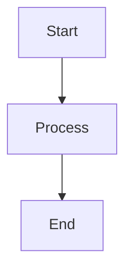
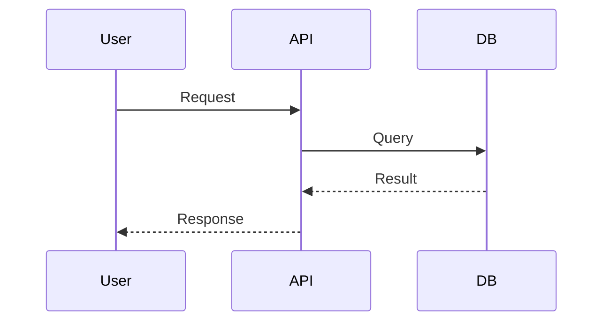

# EPDevio Wiki

A lightweight, Angular-based wiki for high-level software documentation. Document your projects with Markdown, Mermaid diagrams, and Git repository links—organized by projects and categories.


## Features

| Feature | Description |
|--------|-------------|
| **Login** | Sign in to add or edit content (default: `admin` / `admin`) |
| **Markdown** | Full Markdown support for documentation |
| **Mermaid** | Flowcharts, sequence diagrams, and more |
| **Projects & categories** | Organize docs in projects with sub-categories |
| **Git links** | Link projects to their repositories |
| **File-based content** | Store docs as `.md` files in your repo |

## Quick Start

```bash
# Clone the repository
git clone https://github.com/epdsn/EpdevioWiki.git
cd EpdevioWiki/EPDevioWiki

# Install dependencies
npm install

# Start development server
npm start
```

Open [http://localhost:4200](http://localhost:4200).

## Project Structure

```
EPDevioWiki/
├── public/
│   └── wiki/
│       ├── config.json          # Projects, categories, pages
│       └── projects/
│           └── sample/
│               ├── overview/
│               │   ├── readme.md
│               │   └── architecture.md
│               └── api/
│                   └── endpoints.md
├── src/
│   └── app/
└── ...
```

### Configuration (`public/wiki/config.json`)

Define your wiki structure:

```json
{
  "projects": [
    {
      "id": "my-project",
      "title": "My Project",
      "description": "Brief description",
      "gitRepo": "https://github.com/username/repo",
      "categories": [
        {
          "id": "overview",
          "title": "Overview",
          "pages": [
            {
              "id": "readme",
              "title": "Getting Started",
              "file": "wiki/projects/my-project/overview/readme.md"
            }
          ]
        }
      ]
    }
  ]
}
```

## Usage

| Mode | Capabilities |
|------|--------------|
| **Read-only** | Browse projects, categories, and pages |
| **Logged in** | Add projects, categories, and pages; edit content |

Edits and new items (when logged in) are stored in `localStorage` and override file-based content in your browser.

## Mermaid Diagrams

In any Markdown file:

````markdown

````

````markdown

````

## Scripts

| Command | Description |
|---------|-------------|
| `npm start` | Development server at http://localhost:4200 |
| `npm run build` | Production build to `dist/` |
| `npm run watch` | Build with watch mode |

## Requirements

- Node.js 18+
- npm 9+

## License

MIT

## Repository

[https://github.com/epdsn/EpdevioWiki](https://github.com/epdsn/EpdevioWiki)
